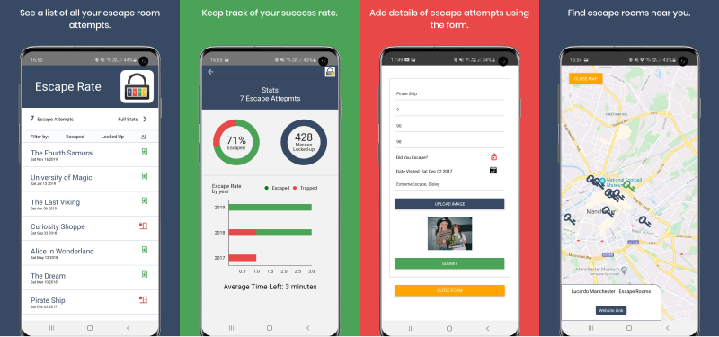

# Escape Rate
---------------------------------------------------------
An android app to log and track escape room attempts. See your statistics and check your success rate.

This app is built with react-native and incorporates some Typescript. It has no back-end and so all data is stored locally using redux and redux-persist.  

## Screenshots

<video width="200" controls>
    <source src="./readmeImages/Escape_rate_demo.mp4" type="video/mp4">
</video>

## Built with:

- **Node.js (v13.7.0)**
- **React-Native (v0.63.0)**
- **Redux (v4.0.5)** 
- **Redux-Persist (v6.0.0)**
- **Formik (v2.1.5)** 
- **React-Native-Maps (v0.27.1)** 
- **Victory-Native (v35.0.1)** 
- **yup (v0.29.2)**
